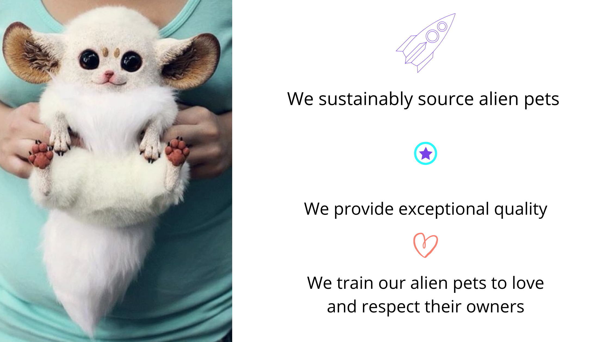

<b>

[Visit our website and adopt your first alien pet today!](http://ufo-tofu.herokuapp.com/)
</b>

---

## Table of contents

- [Technologies](#technologies)
- [Features](#features)
- [Development Team](#development_team)

---

## Technologies
- Axios: version: 0.21.1
- Express: version: 4.16.4
- Express Session: version: 1.15.1
- History: version: 4.9.0
- Morgan: version: 1.9.1
- Passport: version: 0.4.0
- Passport Google Oauth: version: 2.0.0
- Postgres: version: 7.9.0
- React: version: 16.8.6
- React-Redux: version: 7.0.1
- Redux: version: 4.0.1
- Semantic UI CSS: version: 2.4.1
- Semantic UI React: version: 2.0.2
- Sequelize: version: 5.3.1
- Socket.io: version: 2.2.0
---

## Features
- Browse all products and add them to your cart for check out
- Click on an individual product for more details
- Remove and edit cart before checkout
- Sign up to be a repeat customer and have a persistant cart between sessions
- As an administrator, edit and delete users and products
- Check out cart to buy products

Upcoming Features:
- Checkout with real credit card info using Stripe API
- Continuous Integration
- Spec tests
- Persistant cart on guest users

---

## Development_Team

[Kirstie Rodriguez](https://www.linkedin.com/in/kirstierodriguez/) | [Veronica Tomchak](https://www.linkedin.com/in/veronica-tomchak) | [Teofilo Callanaupa](https://www.linkedin.com/in/teofilocallanaupa/") | [Goncagul Ay](https://www.linkedin.com/in/gloriaay/)
